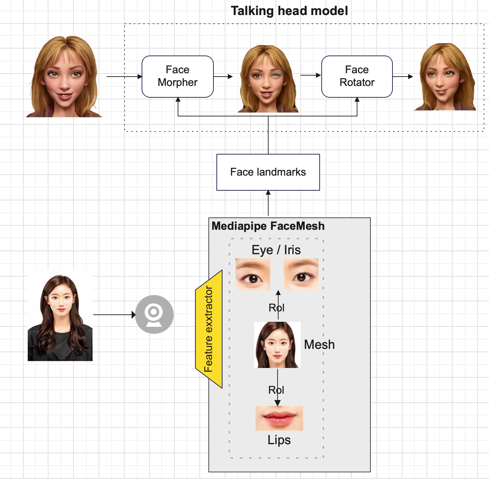
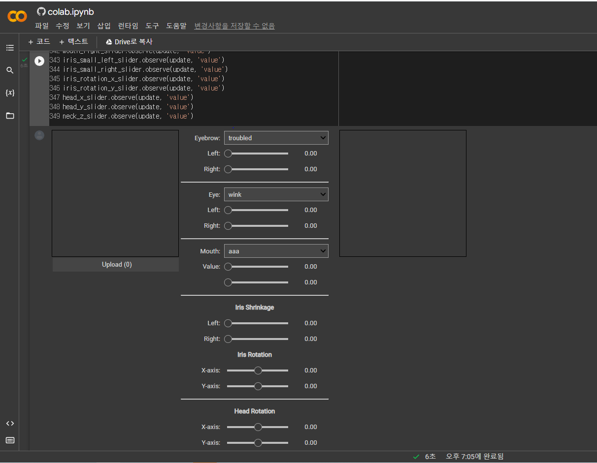
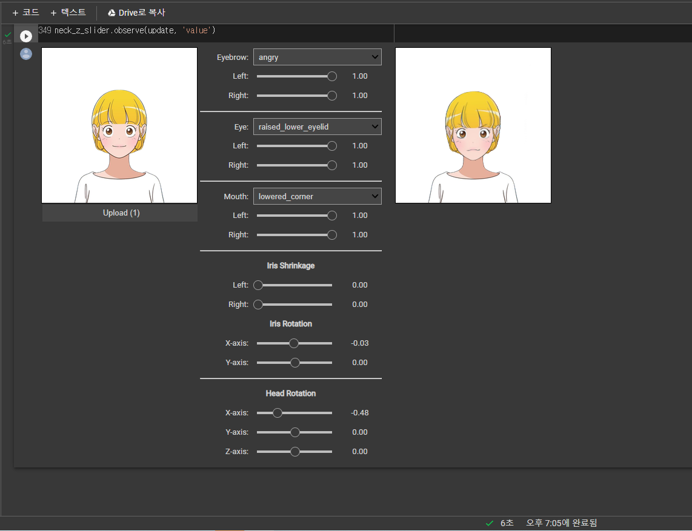

# ImageAnimation
------

DualStyleGan을 통해 만들어진 고정적인 2D 캐릭터 이미지가
화상회의 안에서 사용자의 움직임에 따라 실시간 표정 변화와 얼굴의 움직임이 필요했다 .
우선적으로 웸캠에 비친 사용자의 움짐임을 실시간으로 얼굴 좌표값을 얻어내기 위해 mediapipe를 이용하였다.
사용자의 얼굴을 Mediapipe Face Mesh를 통해 얼굴 특징을 추출한다.
얼굴 특징으로 눈과 눈동자 얼굴 그리고 입술의 landmark를 얻을 수 있었다.
Face landmarks값을 Talking head model에 보낸다.
Talking head model은 2D Single Image를 실시간으로 표정 바꾸고 3D와 같은 움직임을 얻을 수 있는 GAN 모델이다.
Talking head model 안에는 Face Morpher와 Face Rotator 네트워크가 존재한다.
Face Morpher는 눈과 입이 열리는 정도의 표정을 변화시킨다.
원본 캐릭터 이미지의 변경 사항을 나타내는 변경된 이미지를 생성한다.
변경된 이미지는 네트워크 자체에서 생성된 변경 사항을 알파 마스크를 사용하여 원본과 결합한 결과이다.
Face Rotator는 얼굴을 회전시킨다.
얼굴을 회전시키는 영역은 2D가 아닌 3D의 영역이기 때문에 2D 이미지를 3D로 변환하는 알고리즘이 필요하다.
따라서 Face Rotator는 2D 이미지를 3D로 변환하는 Pumarola와 Zhou의 뷰 합성 알고리즘 두개를 사용하여 결과값을 합쳐 제공한다.
최종적으로 고정적인 캐릭터 이미지가 사용자의 Face landmarks 값에 따라 Talking head model을 통해 얼굴 움직임이 바뀐 캐릭터의 다른 이미지를 보여준다.

-----
필요사항
- Python >= 3.8
- Pytorch >= 1.7
- pyvirtualcam(테스트 시 불필요)
- mediapipe
- opencv-python

과정
(pytorch는 이미 설치되어 있다고 가정합니다.)

1. pip install -r requirements.txt

2. [talking head anime model 설치](<https://www.dropbox.com/s/tsl04y5wvg73ij4/talking-head-anime-2-model.zip?dl=0>)
아래 파일들을 pretrained folder에 넣어주세요
- combiner.pt
- eyebrow_decomposer.pt
- eyebrow_morphing_combiner.pt
- face_morpher.pt
- two_algo_face_rotator.pt

3. 가상환경 활성화 -> python test.py

-----
# 이모티콘
https://colab.research.google.com/github/pkhungurn/talking-head-anime-2-demo/blob/master/colab.ipynb
 1. 코랩에 들어가 순서대로 진행합니다.

 2. 모두 진행하면 이미지와 같은 화면이 나옵니다.
 3. upload 버튼을 통해 캐릭터를 선택합니다. character의 yumi.png 를 권장합니다.

 4. 수치를 수동으로 조절하여 얼굴 표정 변화를 확인할 수 있습니다.

현재 저희 프로젝트에서 화남, 기쁨, 슬픔, 윙크, 놀란 등의 표정을 자동으로 생성해주도록 수정중입니다.

### original projects
https://github.com/pkhungurn/talking-head-anime-2-demo
https://github.com/GunwooHan/EasyVtuber
