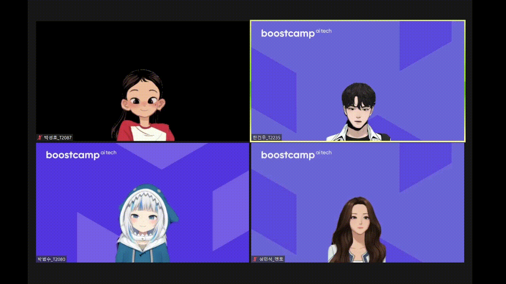
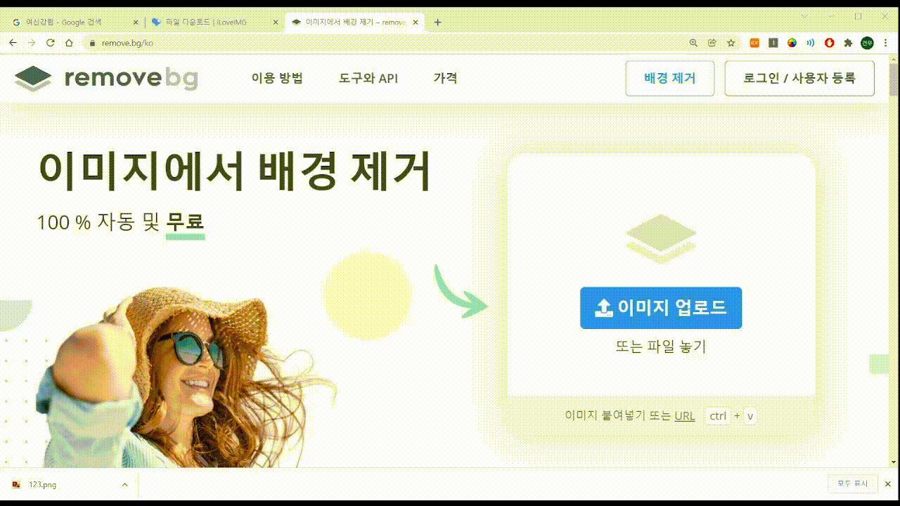

# EasyVtuber


- Facial landmark와 GAN을 이용한 Character Face Generation 
- Google Meets, Zoom 등에서 자신만의 웹툰, 만화 캐릭터로 대화해보세요!
- 악세사리는 어느정도 추가해도 잘 작동해요!
- 안타깝게도 RTX 2070 미만에서는 실시간으로 잘 작동하지 않을 수도 있어요 ㅠㅠ

<br/><br/>

## Demo



<br/><br/>

## Requirements
- Python >= 3.8 
- Pytorch >= 1.7 
- pyvirtualcam
- mediapipe
- opencv-python

<br/><br/>

## Quick Start
- ※ 이 프로젝트는 사용 전 OBS 설치가 필수입니다
- 아래 설치 순서를 __꼭__ 지켜주세요!

1. [OBS studio 설치](<https://obsproject.com/ko>)
   - OBS virtualcam을 사용하기 위해서 먼저 OBS Studio를 설치해야합니다
2. ```pip install -r requirements.txt```
   - OBS virtualcam을 설치되어있어야 requirements에 포함된 pyvirtualcam이 정상적으로 설치되어 사용할 수 있습니다
3. [pretrianed model download](<https://www.dropbox.com/s/tsl04y5wvg73ij4/talking-head-anime-2-model.zip?dl=0>)
   - 아래 파일들을 pretrained folder에 넣어주세요
     - `combiner.pt`
     - `eyebrow_decomposer.pt`
     - `eyebrow_morphing_combiner.pt`
     - `face_morpher.pt`
     - `two_algo_face_rotator.pt`
4. character image를 character folder에 넣어주세요
   - character image 파일은 다음의 조건을 충족해야합니다
     - alpha 채널을 포함할 것(png 확장자)
     - 1명의 인간형 캐릭터일 것
     - 캐릭터가 정면을 볼 것
     - 캐릭터의 머리가 128 x 128 pixel 내에 들어올 것 (기본적으로 256 x 256으로 resize되기 때문에 256 x 256 기준 128x128 안에 들어와야함)
    
    <p align="center">
        
    </p>


5.`python main.py --webcam_output`
   - 실제 facial feature가 어떻게 잡히는지 보고 싶다면 `--debug` 옵션을 추가하여 실행해주세요


<br/><br/>

## How to make Custom Character
1. 네이버, 구글 등에서 본인이 원하는 캐릭터를 찾으세요!
   - 되도록이면 위의 4가지 조건을 맞춰주세요!

<br/><br/>
2. 찾은 이미지에서 캐릭터 얼굴이 중앙으로 가도록 가로세로 1:1 비율로 이미지를 잘라주세요!
   - [이미지 잘라내기 사이트](https://iloveimg.com/ko/crop-image) 광고아님 X

<br/><br/>
3. 이미지 배경을 제거해서 alpha 채널을 만들어 주세요!
   - [배경제거 사이트](https://remove.bg/ko) 광고아님 X

<br/><br/>
4. 완성!
   - character folder에 이미지를 넣고 `python main.py --output_webcam --character (.png_제외한_캐릭터파일_이름)` 실행!

<br/><br/>

## Folder Structure

```
      │
      ├── character/ - character images 
      ├── pretrained/ - save pretrained models 
      ├── tha2/ - Talking Head Anime2 Library source files 
      ├── facial_points.py - facial feature point constants
      ├── main.py - main script to excute
      ├── models.py - GAN models defined
      ├── pose.py - process facial landmark to pose vector
      └── utils.py - util fuctions for pre/postprocessing image
```

<br/><br/>

## Usage
### webcam으로 송출 시
- `python main.py --output_webcam`
### 캐릭터 지정
- `python main.py --character (character folder에 있는 .png를 제외한 캐릭터 파일 이름)`
### facial feature 확인 시
- `python main.py --debug`
### 동영상 파일 inference
- `python main.py --input video파일_경로 --output_dir frame_저장할_디렉토리`

<br/><br/>

## TODOs
- [ ] Add eyebrow feature 
- [ ] Parameter Controller GUI 
- [ ] Automation of Making Drivable Character 

<br/><br/>

## Thanks to
- `이루다` 이미지 사용을 허락해주신 [스캐터랩 이루다팀](https://scatterlab.co.kr), `똘순이 MK1` 이미지 사용을 허락해주신 [순수한 불순물](https://pixiv.net/users/21097691) 님, 늦은 밤까지 README 샘플 영상 만들기 위해 도와주신 [성민석 멘토님](https://github.com/minsuk-sung), [박성호](https://github.com/naem1023), [박범수](https://github.com/hanlyang0522) 캠퍼님, 프로젝트 방향성 조언을 해주신 [김보찬 멘토님](https://github.com/MoMentum99) 모두 감사합니다!

<br/><br/>

## Acknowledgements
- EasyVtuber는 [TalkingHeadAnime2](<https://github.com/pkhungurn/talking-head-anime-2-demo>)를 기반으로 제작되었습니다. 
- tha2 folder의 source와 pretrained model file은 원저작자 repo의 Liscense를 확인하고 사용하시기 바랍니다.